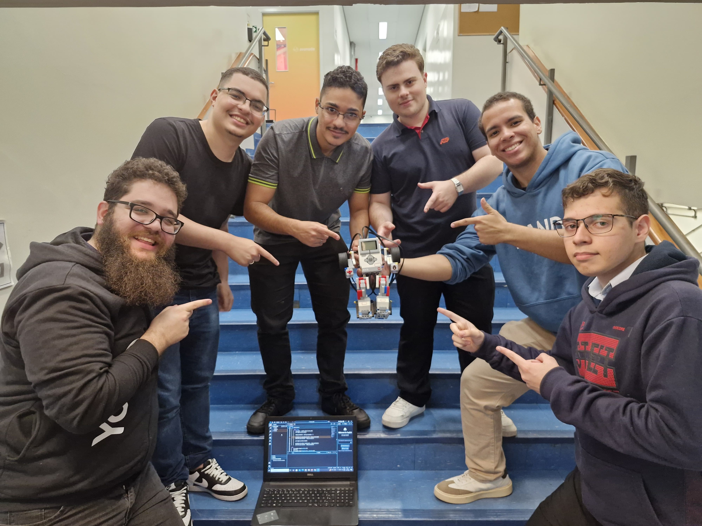

# 🤖 Dance Robot Code

Repositório contendo o código responsável por fazer o **robô dançar** utilizando o **kit LEGO EV3** e o ambiente **Pybricks MicroPython**.

---

## 👥 Integrantes do Grupo

| Nº | Nome Completo | RA |
|----|----------------|----------------------------|
| 1  | Luiz Henrique Carvalhas Lobo de Oliveira | 2301293 |
| 2  | Abner Israel Sanches de Oliveira | 2300152 |
| 3  | Enzo Tavares Lula Silva | 2301843 |
| 4  | Lucas Araújo Andrade Morais | 2300734 |
| 5  | Samuel Felix da Silva | 2300312 |
| 6  | Johnathan Silva Francisco | 2301490 |

---

## 🧠 Descrição do Projeto

O **Dance Robot** é um projeto desenvolvido com o objetivo de **criar um robô móvel e interativo capaz de dançar de forma autônoma**, sincronizando movimentos com o ritmo (BPM) e variando suas ações através de padrões aleatórios de luzes e gestos.

O robô utiliza:
- **Motores grandes (Port B e C)** para simular o movimento das pernas;
- **Motor médio (Port A)** para movimentar os braços;
- **LEDs e alto-falante integrados** para efeitos visuais e sonoros;
- Código em **Pybricks MicroPython**, executado diretamente no **EV3 Brick**.

Durante a execução, o robô:
1. Emite sinais sonoros de início;
2. Ajusta o ritmo da dança conforme o BPM configurado;
3. Alterna cores do LED e direções de movimento de forma sincronizada e aleatória;
4. Finaliza com uma sequência sonora indicando o término da performance.

---

## 🎯 Objetivos

- Integrar conceitos de **robótica móvel** e **controle de movimento**.
- Aplicar **programação em Python** no ambiente embarcado Pybricks.
- Estimular **criatividade, trabalho em equipe e depuração de código em hardware real**.

---

## ⚙️ Execução do Código

O código principal se encontra no arquivo:

```bash
main.py
```

# 💡 Dificuldades Encontradas

Durante o desenvolvimento, enfrentamos desafios como:

- Ajuste da direção dos motores, que variava conforme a montagem física do robô;
- Sincronização de movimentos dos braços e rodas para evitar travamentos;
- Definição do tempo de movimento em relação ao BPM real da música;
- Pequenas variações na resposta dos sensores e no timing das funções wait() e run_time();
- Limitações do ambiente Pybricks em comparação a controladores de tempo de alto nível.

Esses obstáculos foram superados com testes incrementais, análise do comportamento físico e ajustes finos nos parâmetros de velocidade e temporização.

# 📽️ Apresentação do Projeto

## 🎞️ Apresentação em PowerPoint:
Acessar no Google Drive no Link: 
- https://docs.google.com/presentation/d/1aT0CUpTowxYkDz2IGjqz01UDliOKtVxYM3RhmI0p2Zg/edit?usp=drivesdk

## 🎥 Vídeo do Robô Dançando:
Assistir no YouTube via o link:
- https://youtube.com/shorts/aP8Fjj27wiQ?feature=share

## Post do linkedin do robô:
Acessar no linkedin no link:
- https://www.linkedin.com/posts/lui-lobo_quando-engenharia-e-criatividade-se-encontram-activity-7394171491162091520-gJX_?utm_source=social_share_send&utm_medium=member_desktop_web&rcm=ACoAAD_J97kB0OVx97R7ob9NihENc8BEyWDjrFQ

# Foto do grupo com o robô


